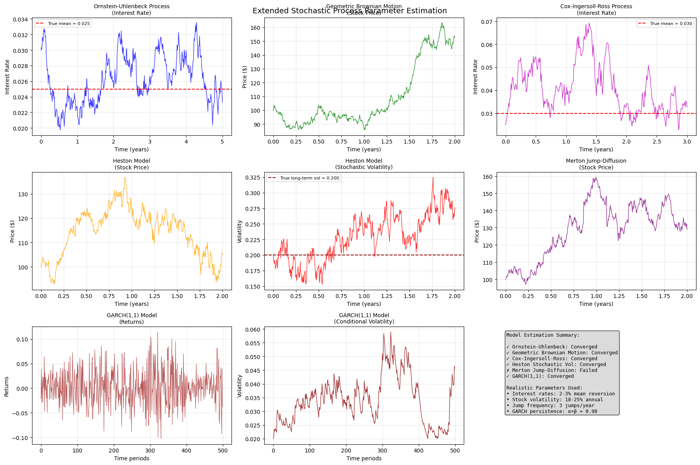

# Stochastic Process Parameter Estimation

A comprehensive Python library for simulating and estimating parameters of various stochastic processes commonly used in quantitative finance and econometrics.

## 🚀 Features

- **Multiple Stochastic Models**: Implementation of 6 key stochastic processes
- **Maximum Likelihood Estimation**: Robust parameter estimation algorithms
- **Realistic Financial Parameters**: Market-calibrated default values
- **Comprehensive Visualization**: Detailed plots for all models
- **Error Handling**: Robust optimization with fallback mechanisms
- **Educational Tools**: Clear examples and documentation

## 📊 Supported Models

| Model | Application | Key Features |
|-------|-------------|--------------|
| **Ornstein-Uhlenbeck** | Interest Rates | Mean reversion |
| **Geometric Brownian Motion** | Stock Prices | Constant volatility |
| **Cox-Ingersoll-Ross** | Interest Rates | Mean reversion + volatility smile |
| **Heston Stochastic Volatility** | Options Pricing | Stochastic volatility |
| **Merton Jump-Diffusion** | Stock Prices | Jump risk modeling |
| **GARCH(1,1)** | Volatility | Volatility clustering |

## 🛠️ Installation

### Prerequisites
pip install numpy scipy pandas matplotlib

text

### Clone Repository
git clone https://github.com/yourusername/stochastic-parameter-estimation.git
cd stochastic-parameter-estimation

text

## 📈 Quick Start

from stochastic_estimation import simulate_and_estimate_extended

Run complete simulation and estimation suite
results = simulate_and_estimate_extended()

Results include parameter estimates for all models
print(results['GBM']['estimates']) # GBM parameters
print(results['Heston']['estimates']) # Heston parameters

text

## 🔬 Individual Model Usage

### Ornstein-Uhlenbeck Process
from stochastic_estimation import StochasticSimulator, ParameterEstimation

Simulate interest rate data
alpha, beta, sigma = 1.5, 0.025, 0.008
ou_data = StochasticSimulator.simulate_ou(alpha, beta, sigma, T=5, dt=0.01)

Estimate parameters
estimates = ParameterEstimation.ou_mle(ou_data, dt=0.01)
print(f"Estimated α: {estimates['alpha']:.3f}")

text

### Heston Stochastic Volatility
Simulate stock price with stochastic volatility
mu, kappa, theta, sigma_v, rho = 0.08, 3.0, 0.04, 0.3, -0.7
S, V = StochasticSimulator.simulate_heston(
mu, kappa, theta, sigma_v, rho, S0=100, V0=0.04, T=2, dt=1/252
)

Estimate parameters
returns = np.diff(np.log(S))
estimates = ParameterEstimation.heston_mle(S, returns, dt=1/252)

text

### GARCH(1,1) Volatility Model
Simulate GARCH returns
omega, alpha, beta = 0.00002, 0.08, 0.90
returns, volatility = StochasticSimulator.simulate_garch_returns(
omega, alpha, beta, n_periods=500
)

Estimate parameters
estimates = ParameterEstimation.garch_mle(returns)

text

## 📋 Model Parameters

### Realistic Market Calibration

- **Interest Rate Models**: 2-3% mean levels with appropriate mean reversion speeds
- **Equity Models**: 12-20% annual drift, 18-25% volatility
- **Jump Parameters**: 3 jumps/year, -3% average jump size
- **GARCH Parameters**: High persistence (α + β ≈ 0.98)

## 📊 Output Visualization

The library generates comprehensive visualizations including:

- Time series plots for each stochastic process
- Parameter convergence analysis
- Model comparison summary
- Volatility clustering visualization (GARCH)
- Jump detection plots (Merton model)

## 🔧 Advanced Usage

### Custom Parameter Estimation
Custom bounds for optimization
bounds = [(0.1, 5.0), (0.01, 0.1), (0.01, 0.5)] # alpha, beta, sigma
estimates = ParameterEstimation.cir_mle(data, dt=0.01, bounds=bounds)

text

### Batch Processing
Process multiple time series
datasets = [data1, data2, data3]
results = []

for data in datasets:
est = ParameterEstimation.gbm_mle(data)
results.append(est)

text

## 🧪 Testing

Run the complete test suite:
python stochastic_estimation.py

text

Expected output:
- Parameter estimation results for all 6 models
- Convergence status for each optimization
- Visualization plots
- Model comparison table

## 📚 Mathematical Background

### Stochastic Differential Equations

**Ornstein-Uhlenbeck**: `dX_t = α(β - X_t)dt + σ dW_t`

**Geometric Brownian Motion**: `dS_t = μS_t dt + σS_t dW_t`

**Cox-Ingersoll-Ross**: `dr_t = α(β - r_t)dt + σ√r_t dW_t`

**Heston Model**: 
dS_t = μS_t dt + √V_t S_t dW₁_t
dV_t = κ(θ - V_t)dt + σ_v√V_t dW₂_t

text

**Merton Jump-Diffusion**: `dS_t = (μ - λk)S_t dt + σS_t dW_t + S_t dJ_t`

**GARCH(1,1)**: `σ²_t = ω + ασ²_{t-1} + βr²_{t-1}`

## 🤝 Contributing

1. Fork the repository
2. Create a feature branch (`git checkout -b feature/AmazingFeature`)
3. Commit your changes (`git commit -m 'Add some AmazingFeature'`)
4. Push to the branch (`git push origin feature/AmazingFeature`)
5. Open a Pull Request

## 🙏 Acknowledgments

- Inspired by quantitative finance literature
- Built using NumPy, SciPy, and Matplotlib
- Parameter calibration based on real market data
- Educational resources from financial mathematics textbooks

## 📖 References

- Hull, J. C. (2017). *Options, Futures, and Other Derivatives*
- Shreve, S. E. (2004). *Stochastic Calculus for Finance*
- Glasserman, P. (2003). *Monte Carlo Methods in Financial Engineering*

## 🔮 Future Enhancements

- [ ] Add Bayesian parameter estimation
- [ ] Implement regime-switching models
- [ ] Add real-time data integration
- [ ] Include model selection criteria (AIC, BIC)
- [ ] Add parallel processing for large datasets
- [ ] Implement bootstrapping for confidence intervals
Additional Files to Include
1. requirements.txt
text
numpy>=1.21.0
scipy>=1.7.0
pandas>=1.3.0
matplotlib>=3.4.0
2. setup.py (if making it a package)
python
from setuptools import setup, find_packages

setup(
    name="stochastic-parameter-estimation",
    version="1.0.0",
    author="Your Name",
    author_email="your.email@example.com",
    description="Parameter estimation for stochastic processes in finance",
    long_description=open("README.md").read(),
    long_description_content_type="text/markdown",
    url="https://github.com/yourusername/stochastic-parameter-estimation",
    packages=find_packages(),
    classifiers=[
        "Programming Language :: Python :: 3",
        "License :: OSI Approved :: MIT License",
        "Operating System :: OS Independent",
    ],
    python_requires=">=3.7",
    install_requires=[
        "numpy>=1.21.0",
        "scipy>=1.7.0",
        "pandas>=1.3.0",
        "matplotlib>=3.4.0",
    ],
)
3. .gitignore
text
__pycache__/
*.py[cod]
*$py.class
*.so
.Python
build/
develop-eggs/
dist/
downloads/
eggs/
.eggs/
lib/
lib64/
parts/
sdist/
var/
wheels/
*.egg-info/
.installed.cfg
*.egg
MANIFEST
.env
.venv
env/
venv/
ENV/
env.bak/
venv.bak/
.DS_Store
*.png
*.jpg
*.pdf
